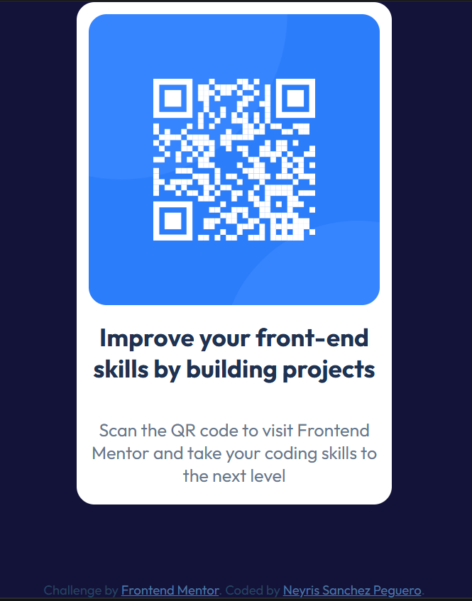

# QR Code Component - Frontend Mentor

This is a solution to the [QR code component challenge on Frontend Mentor](https://www.frontendmentor.io/challenges/qr-code-component-iux_sIO_H). Frontend Mentor challenges help you improve your coding skills by building realistic projects. 

## Table of contents

- [Overview](#overview)
  - [Screenshot](#screenshot)
  - [Links](#links)
- [My process](#my-process)
  - [Built with](#built-with)
  - [What I learned](#what-i-learned)
  - [Continued development](#continued-development)
  - [AI Collaboration](#ai-collaboration)
- [Author](#author)

## Overview

### Project Screenshot

### Links

- Solution URL: [Solution URL](https://github.com/NeyriSanchez/QR.git)
- Live URL: [Live Server URL](https://neyrisanchez.github.io/QR/)

## My process

### Built with

- Semantic HTML5 markup
- CSS custom properties
- Flexbox
- CSS Grid
- Mobile-first workflow
- Google Fonts
- Frontend Mentor assets

### What I learned

In the process of making this proyect i have learned how to structure a simple web component using semantic HTML and style it using CSS. I practiced centering elements with Flexbox and understood how important layout decisions like flex-direction and alignment are when building a design. I also learned how to use a style guide to match colors, spacing, and typography more accurately. Additionally, I improved my understanding of separating structure (HTML) from styling (CSS), and I learned how to properly import and use Google Fonts to match a design system. This project helped me understand how small CSS decisions can significantly affect the overall visual result of a component.

### Continued development

In future projects, I want to strengthen my understanding of Flexbox and build more confidence with responsive design across different screen sizes. I also want to practice more Frontend Mentor challenges to improve my ability to translate designs into clean and organized code. Another focus for me is improving layout consistency and spacing so that my components look more polished and closer to professional UI standards. Over time, I aim to become more comfortable making design decisions without relying too much on guidance.

### AI Collaboration

I used ChatGPT to better understand Flexbox and CSS concepts. It helped me debug my code, guided me through problems without giving complete solutions, and supported me in understanding errors step by step.

## Author

- Frontend Mentor - [@NeyriSanchez](https://www.frontendmentor.io/profile/NeyriSanchez)
